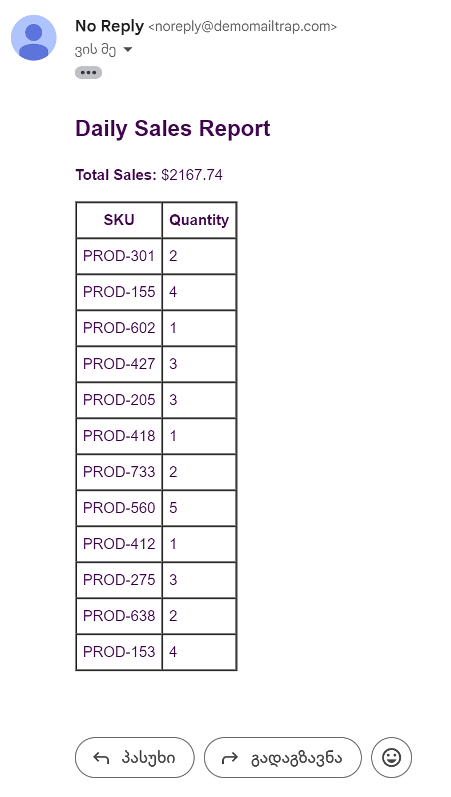

# Invoice Management 

[](https://travis-ci.org/joemccann/dillinger)

Invoices Management System is a comprehensive invoicing solution that enables businesses to create, manage, and track invoices efficiently. It leverages NestJS to provide a powerful API for invoice operations and incorporates automated email notifications through separate microservices. This system streamlines the invoicing process, enhances financial tracking, and improves client communication.

## Features

- Create and manage invoices through a RESTful API
- Automatically generate and send invoice emails
- Query and filter invoices based on various criteria


## Project Installation

### Without Docker

Invoices Management System requires [Node.js](https://nodejs.org/) v14+ to run.
Instructions to install the dependencies and start the services:
```sh
cd invoices-management
cd invoice-service && npm install
cd ../email-sender && npm install
npm run start:dev
```
> Note: Use `npm run start:dev` in each service directory to run the services in development mode

> Note: You can use the tests located in the `main` folder of each service to verify the project

Additionally, you need to install RabbitMQ. Please refer to the <a href="https://www.rabbitmq.com/docs/download">official RabbitMQ website</a> for installation instructions specific to your operating system.

## Docker

Invoices Management System is very easy to install and deploy in a Docker container.

```sh
cd invoices-management
docker-compose build
```

This will create the invoice-service and email-sender images and pull in the necessary dependencies.

Once done, run Docker command as seen in the example

```sh
docker-compose up
```


Once done, the services will be running. You can interact with them using HTTP requests:

```sh
# Create an invoice
curl -X POST http://localhost:3000/invoices -H "Content-Type: application/json" -d '{"customer":"John Doe","amount":100,"reference":"INV-001"}'

# Get all invoices
curl http://localhost:3000/invoices
```

# How to use 

Invoices Management System is a comprehensive application that allows you to manage invoices and automate email notifications. It provides a RESTful API for interacting with the invoice service.

The system automatically generates and sends a daily sales report every 12 hours. This report includes all invoices from the previous day and is sent to the specified email address.
<br>
<br>



> Note! The API can be accessed via HTTP requests. You can use tools like cURL or Postman to interact with the services.

</br>


### CLI call example


</br>

## Example 1:

</br>

#### Creating an Invoice

> Note! To create a new invoice, you can use the POST endpoint:

```curl
curl -X POST http://localhost:3000/invoices -H "Content-Type: application/json" -d '{
  "customer": "John Doe",
  "amount": 100.00,
  "reference": "INV-001",
  "date": "2023-05-15",
  "items": [
    {"sku": "ITEM-1", "qt": 2}
  ]
}'
```

This will return the created invoice:: 

```json
{
  "success": true,
  "data": {
    "_id": "60a7c1c77c213e001f3e5f7c",
    "customer": "John Doe",
    "amount": 100.00,
    "reference": "INV-001",
    "date": "2023-05-15T00:00:00.000Z",
    "items": [
      {"sku": "ITEM-1", "qt": 2}
    ]
  }
}
```
## Example 2:

</br>

#### Retrieving all invoices, GET endpoint:

> Note! To retrieve a specific invoice, you can use the GET endpoint with the invoice ID:

```curl
curl http://localhost:3000/invoices
```

This will return a list of all invoices:

```json
{
  "success": true,
  "data": [
    {
      "_id": "60a7c1c77c213e001f3e5f7c",
      "customer": "John Doe",
      "amount": 100.00,
      "reference": "INV-001",
      "date": "2023-05-15T00:00:00.000Z",
      "items": [
        {"sku": "ITEM-1", "qt": 2}
      ]
    },
    // ... other invoices
  ]
}
```
## Example 3:

</br>

#### Getting a Specific Invoice

> Note! To retrieve a specific invoice, you can use the GET endpoint with the invoice ID:

```curl
curl -X POST http://localhost:3000/invoices -H "Content-Type: application/json" -d '{
  "customer": "John Doe",
  "amount": 100.00,
  "reference": "INV-001",
  "date": "2023-05-15",
  "items": [
    {"sku": "ITEM-1", "qt": 2}
  ]
}'
```

This will return the created invoice:: 

```json
{
  "success": true,
  "data": {
    "_id": "60a7c1c77c213e001f3e5f7c",
    "customer": "John Doe",
    "amount": 100.00,
    "reference": "INV-001",
    "date": "2023-05-15T00:00:00.000Z",
    "items": [
      {"sku": "ITEM-1", "qt": 2}
    ]
  }
}
```


## License

MIT

**Free Software, Hell Yeah!**